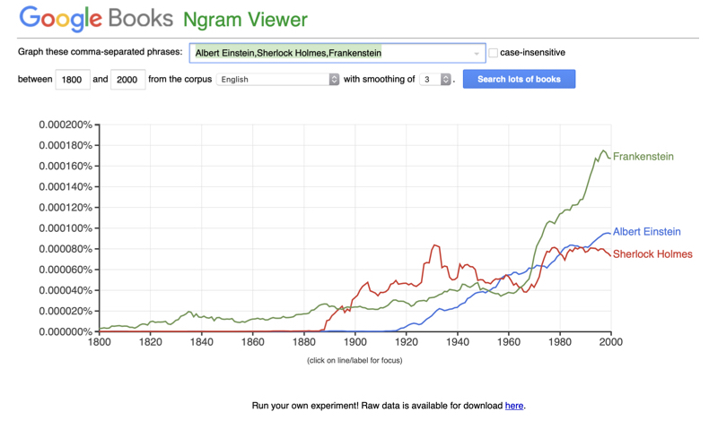

## Access the Notebooks

- [Ngrams and language modeling](https://mybinder.org/v2/gh/anyl580/lectures/master?urlpath=notebooks/4-ngrams/ngrams.ipynb)

- [Peter Norvig, How to do things with words](https://github.com/norvig/pytudes/blob/master/ipynb/How%20to%20Do%20Things%20with%20Words.ipynb)
## Reading

As usual, the assumption is that you have read the chapter and also watched corresponding videos from Jurafsky and Manning.

- [J&M 3: N-Gram Language Models](https://web.stanford.edu/~jurafsky/slp3/3.pdf)

- [Video playlist](https://www.youtube.com/playlist?list=PLQiyVNMpDLKnZYBTUOlSI9mi9wAErFtFm)

## In the Media

- [Flesch-Kincaid story](https://www.bostonglobe.com/news/politics/2015/10/20/donald-trump-and-ben-carson-speak-grade-school-level-that-today-voters-can-quickly-grasp/LUCBY6uwQAxiLvvXbVTSUN/story.html?event=event25) and a review of this from [Language Log](https://languagelog.ldc.upenn.edu/nll/?p=21847). If you follow this link, you get to [a report on "the dumbing down of Congress"](https://sunlightfoundation.com/2012/05/21/congressional-speech/) and then finally to a [github gist](https://gist.github.com/drinks/2483508) with a bit of NLTK magic for counting syllables. Is this bad science?

- [Real trends in words and sentence lengths](https://languagelog.ldc.upenn.edu/nll/?p=3534)
> "The results suggest that mean word lengths have decreased slightly in these addresses over the past century - by 5% or so - while mean sentence lengths have been falling since the founding of the republic, and have undergone a cumulative drop of perhaps 50%."

- 

- [Google Culturomics paper (Google ngrams), 2011](https://pdfs.semanticscholar.org/8f00/57d3c0f04982fab0b34f29a118247e6858b0.pdf)

- [The pitfalls of studying language with Google ngrams](https://www.wired.com/2015/10/pitfalls-of-studying-language-with-google-ngram/)

- [Using the cloud to explore the linguistic patterns of half a trillion words of news homepage hyperlinks](https://www.forbes.com/sites/kalevleetaru/2019/09/02/using-the-cloud-to-explore-the-linguistic-patterns-of-half-a-trillion-words-of-news-homepage-hyperlinks/#74994b02342b)

- [GDELT Project](https://www.gdeltproject.org)
> Supported by Google Jigsaw, the GDELT Project monitors the world's broadcast, print, and web news from nearly every corner of every country in over 100 languages and identifies the people, locations, organizations, themes, sources, emotions, counts, quotes, images and events driving our global society every second of every day, creating a free open platform for computing on the entire world

- [Large language models in machine translation (2007)](https://www.aclweb.org/anthology/D07-1090)
> "Stupid backoff" - A distributed infrastructure is proposed which we use to train on up to 2 trillion tokens, resulting in language models having up to 300 billion n-grams.

- [A distributed system for large-scale n-gram language models at Tencent (2019)](A distributed system for large-scale n-gram language models)
> Even more scaling for network overhead... Tencent's WeChat ASR with the peak network traffic at the scale of 100 millions of messages per minute.

- [A spelling correction program based on a noisy channel model](http://delivery.acm.org/10.1145/1000000/997975/p205-kernighan.pdf?ip=23.82.10.248&id=997975&acc=OPEN&key=4D4702B0C3E38B35%2E4D4702B0C3E38B35%2E4D4702B0C3E38B35%2E6D218144511F3437&__acm__=1569181944_fee165eb16f3bbfb15e4b2212a7bbf5c) - this is a description of the Unix spell program from Kernighan, Church, and Gale from Bell Labs!

- Some frequency data derived by Peter Norvig from data files using the Google Web Trillion Word Corpus](http://norvig.com/ngrams/)
