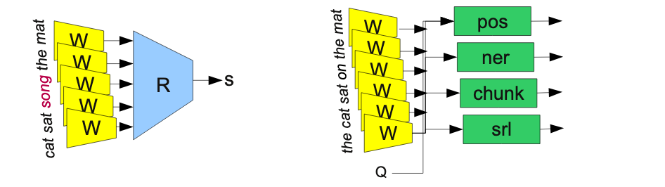

## Access the Notebooks
- [MT Overview](https://mybinder.org/v2/gh/anyl580/lectures/master?urlpath=notebooks/9-machine-translation/machine-translation.ipynb)

## Readings

- Colah's Blog - [Deep Learning, NLP and Representations](https://colah.github.io/posts/2014-07-NLP-RNNs-Representations/)

- Jay Alammer's Blog, [Visualizing a Neural MT Model](http://jalammar.github.io/visualizing-neural-machine-translation-mechanics-of-seq2seq-models-with-attention/)

- Jay Alammer's Blog, [The Illustrated Transformer](http://jalammar.github.io/illustrated-transformer/)

- Optional. [Illustrated Attention](https://towardsdatascience.com/attn-illustrated-attention-5ec4ad276ee3)

- Optional. [A Survey of Cross-Lingual Word Embedding Models](https://ruder.io/cross-lingual-embeddings/)

## Related Papers

- Bottou (2011). [From Machine Learning to Machine Reasoning](https://arxiv.org/ftp/arxiv/papers/1102/1102.1808.pdf)  - Training intermediate word representations for multiple NLP tasks.

- Zou, Socher, Cer & Manning. (2013) [Bilingual word embeddings for phrase-based MT](http://ai.stanford.edu/~wzou/emnlp2013_ZouSocherCerManning.pdf)

- Socher et al. (2013) [Recursive Deep Models for Semantic Compositionality Over a Sentiment Treebank](https://nlp.stanford.edu/~socherr/EMNLP2013_RNTN.pdf)

- Cho et al. (2014). [Learning Phrase Representations using RNN Encoder-Decoder for Statistical Machine Translation](https://arxiv.org/pdf/1406.1078v1.pdf)

- Koehn Statistical MT Book. [Chapter 5, Phrase-Based Models](http://www.statmt.org/book/slides/05-phrase-based-models.pdf)

- Bahadanau, Cho, and Bengio (2015). [Neural MT by Jointly Learning to Align and Translate](https://arxiv.org/pdf/1409.0473.pdf)

-  SDL website. [Understanding MT Quality Bleu Scores](https://www.sdl.com/blog/understanding-mt-quality-bleu-scores.html)

- Papini et al. (2002). [Bleu: a Method for Automatic Evaluation of MT](https://www.aclweb.org/anthology/P02-1040.pdf)

- Koehn and Knowles (2017). [Six Challenges for Neural Machine Translation](https://www.aclweb.org/anthology/W17-3204.pdf)

- Vanmassenhove, E., Du, J., & Way, A. (2017). [Investigating 'aspect' in nmt and smt: Translating the english simple past and present perfect](https://pdfs.semanticscholar.org/0af7/d94d4923cd7ca13c023de194e0f59e257c2a.pdf)

## Models and Tools

- FaceBook Laser -  [https://engineering.fb.com/ai-research/laser-multilingual-sentence-embeddings/](https://engineering.fb.com/ai-research/laser-multilingual-sentence-embeddings/)

- Rule-Based MT - http://[www.apertium.org](www.apertium.org)

- Moses, statistical MT - [http://www.statmt.org](http://www.statmt.org)

## Videos

- Stanford CS224N NLP with Deep Learning. [Lecture 8. Translation, seq2seq, Attention](http://youtu.be/XXtpJxZBa2c). [Slides here](http://web.stanford.edu/class/cs224n/slides/cs224n-2019-lecture08-nmt.pdf). Some images in this week's lecture taken from here.

- Russian to English 1954. [1 minute video](https://www.youtube.com/watch?v=K-HfpsHPmvw&feature=youtu.be).
