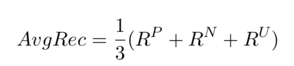

For this project, you will focus on the task of sentiment analysis of English Twitter data.

### Task Description

You have three basic tasks:
1. Exploratory data analysis
2. Message polarity classification - given a message, classify whether it is positive, negative, or neutral sentiment
3. Performance evaluation of your classifier

One of the more difficult challenges for NLP in practice is evaluating performance. Fortunately, the larger research community puts significant effort into the development of data for training, development, and testing.

You will be provided three data sets (train, dev, test) for development and testing.

### Competition

To make this project more interesting and challenging, you will compete with one another in a leaderboard for highest score. We'll also award teams for best report and have you all vote on most innovative or interesting.

### Data

For this project, you will use provided training, development, and test data in the files directory on Canvas under assignment 1. The final test data will be made available on 8 October.

The zip file contains:
- Data/Dev - This is your INPUT file (INPUT.txt); the data you will classify
- Data Gold -train.txt. This is the data for training your model.
- Data/Gold - dev.txt. This is the validation data set for tuning your model.
- Data/Gold - devtest.txt. This is what you can evaluate your results with during your development time.
- Data/Gold - test.ext. This is what you can use to evaluate your results before you provide you a final test set.
- Data/Test - This is the (gold) data for evaluating your model. We will provide this data set the day your assignment is due, thus the folder is empty.

### Task 1: Exploratory Data analysis (5 points)

You will do exploratory data analysis to first summarize statistical and other characteristics of your data.

The most basic statistics on corpora are simply **observed absolute frequencies** (Gries, 2010).

#### Input data (Data in the dev directory)
- The total number of tweets
- The total number of characters
- The total number of distinct words (vocabulary)
- The average number of characters and words in each tweet
- -The average number and standard deviation of characters per token
- The total number of tokens corresponding to the top 10 most frequent words (types) in the vocabulary
- The token/type ratio in the dataset
- The total number of distinct n-grams (of words) that appear in the dataset for n=2,3,4,5.
- The total number of distinct n-grams of characters that appear for n=2,3,4,5,6,7
- Plot a token log frequency. Describe what this plot means and how to interpret it. Describe out it might help you understand coverage when training a model?

#### Gold (Gold directory)
- What is the number of types that appear in the dev data but not the training data (OOV).?
- Look at the vocabulary growth (types) combining your four gold data sets against your input data. Plot vocabulary growth at difference sample sizes N.
- What is the class distribution of the training data set - how many negative, neutral, positive tweets?
- Look at the difference between the top word types across these three classes.
- What words are particularly characteristic of your training set and dev set? Are they the same?

### Task 2: Message Polarity (10 points)

Sentiment analysis is another tool useful in exploratory data analysis for quantifying the emotional valence of messages. In combination with other methods such as topic analysis and social network analysis, it may provide emotional context around topics of discussion.Build and compare three or more classifiers that predict a tweet is positive, negative, or neutral in sentiment. This is a single label, multi-class classification task where each tweet is classified as belonging to exactly one of these three classes.

-  Use only methods described in J&M chapters 2, 3, 4, and 5. In practice, this means you can use lexicon-based sentiment analyzers (e.g., Vader), Naive Bayes, and Logistic Regression (though, we will not have had much time to cover it at assignment time). This means you should not yet do topic analysis or other methods yet to be discussed in the syllabus such as neural networks. If in doubt, please ask. We'll have a later exercise with this same dataset where you will do topic analysis on this data set.
- You are encouraged to experiment with different approaches for cleaning and pre-processing your data (e.g., stemming/lemmatization, cleaning with regexes, etc.).
- If you extracted features, list them.
- Feel free to use any sentiment lexicons you use or create.
- You may add additional data sets to those provided (except for the test data set).
- Describe your implementation decisions in commented code.

### Task 3: Performance evaluation (5 points)

You will have two different evaluation metrics:
- **F-measure** (also known as F1) for precision and recall. (Include your **precision** and **recall** scores)
- **Average Recall**

* Create a results table that compares performance of the algorithms you chose for analysis.
* Speculate on the differences between the two performance measures above.
* Look at your results and find / show examples where your classifiers have mis-performed. What sorts of phenomena do you see and speculate on why you see these errors. Are there distinct differences between classifiers or are differences difficult to see from your results?
* How important was tokenization / feature extraction?
* If you had more time, what might you do differently? What questions do you know have about your analysis that you didn't have before starting?
